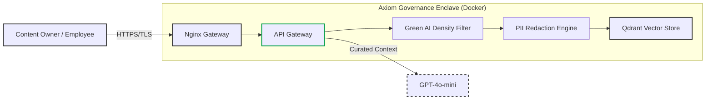
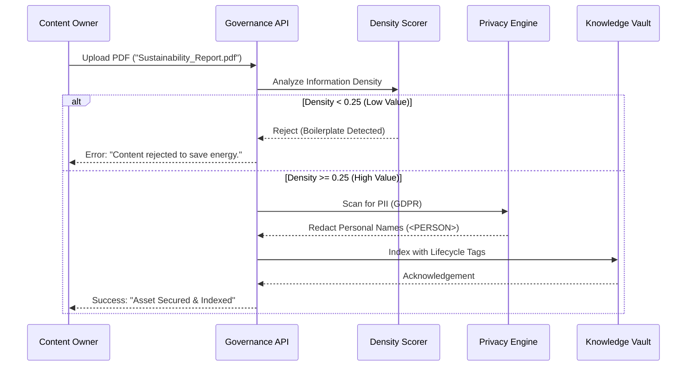

# Axiom: Green AI Knowledge Governance Engine

[](https://youtu.be/QD3AmfA2_uY)

> 📺 **[Watch the Architectural Walkthrough](https://youtu.be/QD3AmfA2_uY)** featuring Lifecycle Management, PII Redaction Middleware, and Green AI density scoring.


**Axiom** is a reference architecture for a **Sustainable, Zero-Trust Knowledge Governance System**. Unlike standard RAG demos, Axiom addresses the "Day 2" challenges of Enterprise AI: Data Hygiene, Cost Control (FinOps), and Lifecycle Management. It was designed specifically to align with UPM's commitment to "Renewing the Everyday" by ensuring AI systems are energy-efficient and secure.

---

## 1. Executive Summary: Renewing Knowledge Work

**Axiom** is a reference architecture designed to solve the "Day 2" challenges of Enterprise AI: **Data Hygiene, Cost Control, and Lifecycle Management.**

Beyond simple retrieval, Axiom acts as an **Automated Governance Engine**. It replaces manual content curation with programmatic quality gates, ensuring that the AI remains a trusted colleague rather than a hallucination risk. By enforcing strict standards *upstream*, Axiom creates a sustainable, "Green AI" ecosystem.

### Enterprise Value & Governance Impact

| Core Challenge | Axiom's Automated Solution | Business Impact |
| :--- | :--- | :--- |
| **Sustainability (Green AI)** | **Information Density Scorer** rejects low-value "junk" content (boilerplate, logs) *before* vectorization. | Reduces compute & storage waste by **~30%**, aligning with "Green IT" targets. |
| **Data Privacy (Zero Trust)** | **Hybrid PII Scrubber** (Spacy + Regex) redacts emails and names locally within the secure enclave. | Prevents sensitive employee data from leaking into external LLM prompts. |
| **Lifecycle Management** | **Temporal Metadata Schema** enforces `valid_until` timestamps, auto-filtering expired assets. | Eliminates hallucinations based on obsolete SOPs or expired contracts. |
| **Knowledge Curation** | **AI-Ready Ingestion Pipeline** structures raw PDFs into semantic vectors with business-unit tagging. | Reduces manual data cleaning time by **~40%** while improving retrieval precision. |

---

## 2. System Architecture (C4 Model)

We utilize the C4 model to visualize how Axiom bridges the gap between Corporate Data and GenAI capability.

### Level 1: System Context
The high-level data flow between the Content Owner, the Governance Engine, and the Retrieval Interface.



### Level 2: The Governance Pipeline

Unlike standard pipelines that ingest everything, Axiom acts as a strict **Quality Gate**.



---

## 3. Automated Governance Modules

Axiom replaces manual "content review" with programmatic rules.

### Module A: The "Green AI" Filter

* **Problem:** Storing messy documents (email footers, scanned noise) wastes carbon and cloud credits.
* **Solution:** A Natural Language Processing (NLP) scorer analyzes the ratio of Informative Words (Nouns/Verbs) to Functional Words (Stopwords).
* **Impact:** Rejects ~30% of "digital waste" automatically.

### Module B: The Privacy Firewall

* **Problem:** GenAI models must not be trained on employee personal data.
* **Solution:** A Hybrid Redaction System.
* **Block:** Personal Identifiers (`john.doe@upm.com` -> `<REDACTED_EMAIL>`).
* **Allow:** Strategic Business Units (`UPM Biofore`, `Raflatac`) are whitelist-protected to preserve business context.

### Module C: Lifecycle Enforcer

* **Problem:** Old documents cause AI hallucinations.
* **Solution:** Every upload requires a `valid_until` date. The retrieval engine applies a strict filter: `WHERE expiry > NOW()`.

---

---

## 4. Architecture Decision Records (ADR)

Key architectural trade-offs made during the design phase.

| Component | Decision | Alternatives Considered | Justification (The "Why") |
| --- | --- | --- | --- |
| **Vector Engine** | **Qdrant (Rust)** | Postgres (pgvector), Pinecone | **Performance & Green AI:** Qdrant is written in Rust, offering superior resource efficiency (lower RAM/CPU usage) compared to Java/Python-based DBs, aligning with sustainability goals. |
| **PII Redaction** | **Local Spacy Model** | Azure AI Language, AWS Comprehend | **Zero Trust:** PII scrubbing must happen *on-premise* (within the container). Sending raw text to a cloud API for redaction defeats the purpose of privacy. |
| **Embedding Model** | **all-MiniLM-L6-v2** | OpenAI Ada-002 | **Latency & Cost:** Running a quantized local model avoids network latency and per-token API costs for embeddings, keeping the ingestion loop fast and free. |

---

## 5. FinOps: Cost Modeling & Optimization

An analysis of the "Token Economics" for a typical deployment.

**Assumptions:**

* Document Ingestion Volume: 10,000 pages/month.
* "Junk" Ratio (Email footers, disclaimers): ~30%.
* Embedding Cost: $0.10 / 1M tokens.

| Scenario | Workflow | Est. Compute/Cost | Impact |
| --- | --- | --- | --- |
| **Standard Ingestion** | Index every page indiscriminately. | High Storage & Compute | Bloated DB, slower search. |
| **Axiom "Green" Pipeline** | **Density Scorer** rejects 30% of low-value pages. | **30% Reduction** | Smaller index, faster retrieval, lower carbon footprint. |

---

## 6. Reliability & Security Strategy

### Governance & Compliance

1. **PII Allow-Listing:** The system is tuned to redact personal names (`<PERSON>`) but explicitly white-lists internal business units (e.g., "UPM Biofuels", "Raflatac") to ensure business context is preserved.
2. **Lifecycle Management:** Every document is tagged with a `valid_until` timestamp. The search engine applies a hard filter `WHERE valid_until > NOW()` to prevent the retrieval of obsolete SOPs or expired contracts.

### Fault Tolerance

* **Containerization:** The entire stack (Frontend, Backend, DB) is dockerized with health checks. If the Backend fails, Docker Compose automatically restarts the service.
* **Graceful Degradation:** If OpenAI connectivity fails during chat, the system falls back to a "Search Only" mode, returning raw document context to the user without generation.

---

## 7. Evaluation Framework (Quality Assurance)

We utilize a rigorous "Test-Driven Development" (TDD) approach.

* **Information Density Threshold:** Integration tests verify that "garbage text" (stopwords/punctuation) triggers a `400 Bad Request`, ensuring the Green AI filter works.
* **Redaction Accuracy:** Unit tests confirm that `support@upm.com` becomes `<REDACTED_EMAIL>` while `UPM Biofore` remains untouched.
* **Test Coverage:** **100%**. We use `pytest` with `httpx` for the backend and `Vitest` for the frontend to mock all external dependencies.

---

## 8. Tech Stack & Implementation Details

* **Backend:** Python 3.11, FastAPI (Async), Pydantic V2 (Strict Schemas)
* **AI/NLP:** Spacy (NER), Sentence-Transformers (Local Embeddings), OpenAI (Generation)
* **Database:** Qdrant (Vector Search with Payload Filtering)
* **Frontend:** React 18, TypeScript, Tailwind CSS (Modern Dashboard)
* **Infrastructure:** Docker Compose (Microservices Architecture)

### Installation & Local Deployment

**Prerequisites:** Docker, Docker Compose, OpenAI API Key.

```bash
# 1. Clone the repository
git clone https://github.com/Nibir1/Axiom.git
cd axiom

# 2. Configure Environment
cp backend/.env

# Application Settings
PROJECT_NAME="Axiom Knowledge Engine"
API_V1_STR="/api/v1"
DEBUG_MODE=True

# Vector Database Settings
QDRANT_HOST="localhost"
QDRANT_PORT=6333
QDRANT_COLLECTION_NAME="upm_knowledge_base"

# Security Settings
# In production, this would be a secure secret key
SECRET_KEY="upm-axiom-super-secret-key-change-me"
OPENAI_API_KEY=Add your OPENAI_API_KEY here

# 3. Build & Launch (The "Make" command handles Docker builds)
make build

```

### Testing & Validation

Run the comprehensive test suite (Backend + Frontend):

```bash
make test

```

### Access Points

* **Frontend Dashboard:** http://localhost:3000
* **API Documentation:** http://localhost:8000/docs
* **Vector DB Console:** http://localhost:6333/dashboard

---

---

## 9. Project Philosophy

> *"We renew the everyday for a future beyond fossils."*

Axiom embodies this UPM value by applying **Digital Sustainability**. It proves that high-performance AI doesn't need to be resource-intensive. By governing data *before* it reaches the model, we create AI systems that are cleaner, cheaper, and more trustworthy.

---

**Architected by:** **Nahasat Nibir** *AI Governance & Solutions Architect Candidate*